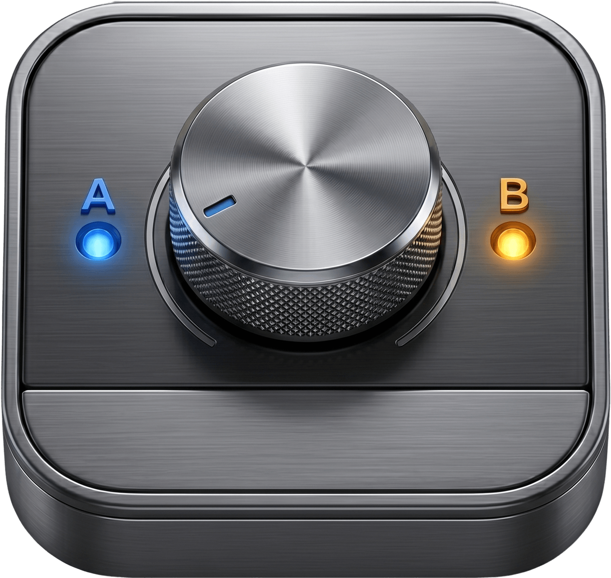
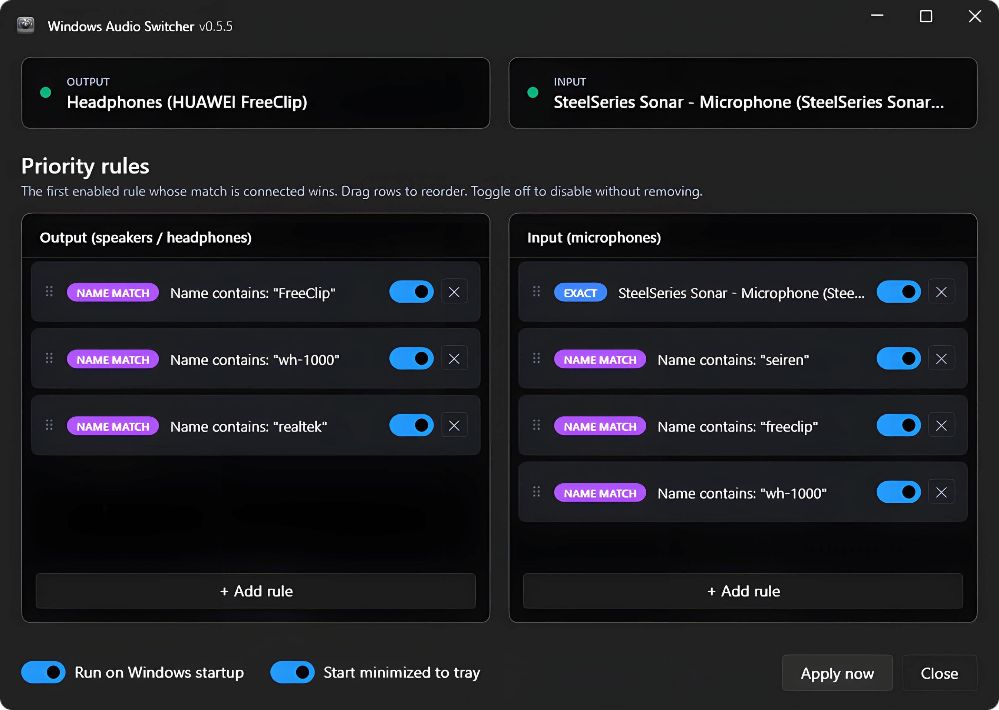

<p align="center">
  
</p>

<h1 align="center">Windows Audio Switcher</h1>

<p align="center">
  <a href="https://ko-fi.com/A0T81ZY16Q"></a>
</p>

> **Built with AI to scratch a personal itch.** Windows has no built-in way to keep your preferred audio device as the default when it disconnects and reconnects — especially Bluetooth headsets. I hit this every day, so I built this tool with AI assistance to solve it.

Automatic default-audio device switcher for Windows. Lives in the system tray and re-selects your preferred output and input devices whenever something connects, disconnects, or Windows changes the default.

<p align="center">
  
</p>

## Features

- **Priority list per direction** — separate priorities for output (speakers/headphones) and input (microphones). The first matching *active* device wins; offline devices are skipped, so fallback rules don't block higher-priority ones.
- **Two rule kinds:**
  - **Exact device** — pin a specific endpoint by its Windows device ID.
  - **Name contains** — e.g., a rule for `Sony` matches any device whose friendly name contains "Sony", so a reconnecting Bluetooth headset is reselected even if Windows assigns it a new endpoint ID.
- **All three audio roles** switched together: Console, Multimedia, and Communications (so Teams/Discord follow too).
- **Tray-resident**, single-instance.
- **Run on Windows sign-in** — optional, set during install or from the tray menu.
- **Built-in auto-updater** — the app checks for new releases on startup. When one's available, a banner lets you update with a single click: the new installer is downloaded, runs silently, and the app relaunches itself on the new version. No reinstall ceremony, no admin prompt.
- **Self-contained installer** — no .NET runtime required on the target machine.

## Install

Grab the latest setup from the [Releases page](https://github.com/mariosemes/WindowsAudioSwitcher/releases) and run it.

- Per-user install to `%LOCALAPPDATA%\Programs\WindowsAudioSwitcher`
- No admin / UAC prompt
- Registers in **Apps & Features** with its own uninstaller
- The installer wizard offers Start-menu shortcut, Desktop shortcut, and "Launch on Windows sign-in" as optional tasks

## Usage

1. Launch from the Start Menu (or it's already running in the tray if you ticked "Launch on sign-in" during install).
2. Right-click the tray icon → **Settings…**
3. **Add device…** to pin an endpoint that's connected right now, or **Add name rule…** for a substring fallback (e.g., `Sony`).
4. Reorder with the **↑ / ↓** buttons. Top of the list = highest priority.
5. **Save & Apply**.

The app re-evaluates priorities automatically on device add/remove and whenever Windows changes the default endpoint. You can also force a re-evaluation from the tray menu → **Apply rules now**.

## Settings location

Your priority list is stored as JSON at:

```
%APPDATA%\WindowsAudioSwitcher\settings.json
```

This file is left in place on uninstall, so reinstalling preserves your rules.

## Uninstall

Use **Settings → Apps → Installed apps → Windows Audio Switcher → Uninstall**, or run the uninstaller from the install folder.

## Got an idea?

Have an idea on how to make the app even better? Found a bug? Want a feature that would make your daily audio juggling less painful? **[Open an issue on GitHub](https://github.com/mariosemes/WindowsAudioSwitcher/issues)** — feedback is welcome and shapes what gets built next.

## License

Licensed under the [**PolyForm Noncommercial License 1.0.0**](LICENSE).

**TL;DR — what you can do:**
- ✅ Download and use the app for free, forever
- ✅ Read, study, and modify the source code
- ✅ Share copies, including modified versions

**What you can't do:**
- ❌ Sell the app, or charge anyone for using it
- ❌ Bundle it into a paid product or paid service
- ❌ Use it (or any part of the code) as the basis of something you make money from

If you'd like to use this commercially, get in touch — separate terms can be arranged.

Copyright © Mario Semes.

---

## Support

If this tool saves you some daily friction and you'd like to say thanks, you can buy me a coffee. Scan the QR or hit the button — either works.

<p align="center">
  <a href="https://ko-fi.com/A0T81ZY16Q"></a>
  <br>
  <a href="https://ko-fi.com/A0T81ZY16Q"></a>
</p>
